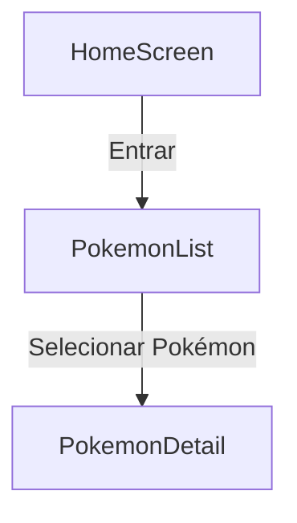

# Aplicativo Pokédex (React Native + PokéAPI)

## Visão Geral
Aplicativo móvel desenvolvido em **React Native** que consome dados da **PokéAPI**. Exibe uma lista de Pokémons e permite visualizar detalhes individuais, como altura, peso, tipos, habilidades e estatísticas. Este aplicativo é requisito para uma atividade da disciplina PROGRAMAÇÃO PARA DISPOSITIVOS MÓVEIS do curso de Tecnólogo em Análise e Desenvolvimento de Sistemas.

---

## Instalação de Dependências

### 1. Pré-requisitos
- [Node.js](https://nodejs.org/) (versão LTS recomendada)  
- [npm](https://www.npmjs.com/) ou [yarn](https://yarnpkg.com/)  
- [Expo CLI](https://docs.expo.dev/get-started/installation/)  

### 2. Clonar o repositório
```bash
git clone https://github.com/seu-usuario/pokedex-app.git
cd pokedex-app
```

### 3. Instalar dependências
```bash
npm install
# ou
yarn install
```

### 5. Executar o aplicativo
```bash
npx expo start
```

---

## App.tsx
Arquivo principal que inicializa a navegação entre telas.

- Configura o **NavigationContainer** e rotas com `@react-navigation/native`.
- Define três telas:
  - **Home**: tela inicial.
  - **Lista**: exibe a listagem dos Pokémons.
  - **Detalhes**: mostra informações detalhadas do Pokémon.

---

## PokemonList.tsx
Responsável por listar Pokémons obtidos da PokéAPI.

1. Requisição para `https://pokeapi.co/api/v2/pokemon/?limit=20`.
2. Obtém nome e imagem de cada Pokémon.
3. Permite navegação para tela de detalhes.

---

## PokemonDetail.tsx
Exibe detalhes do Pokémon selecionado, incluindo:
- Imagem oficial.
- Altura e peso.
- Tipos, habilidades e estatísticas.

---

## Fluxo de Navegação



---

## Créditos
Dados fornecidos por [PokéAPI](https://pokeapi.co)

